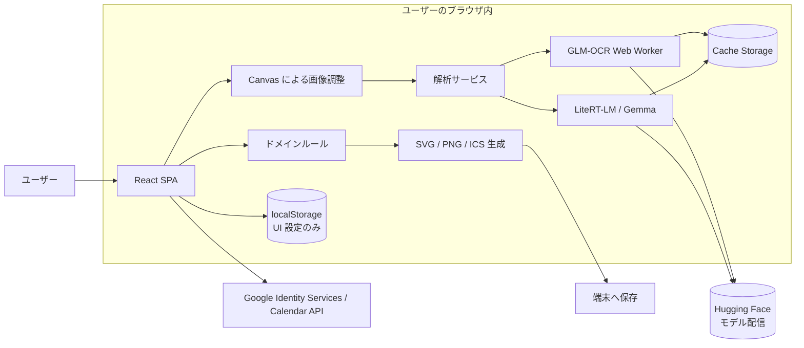
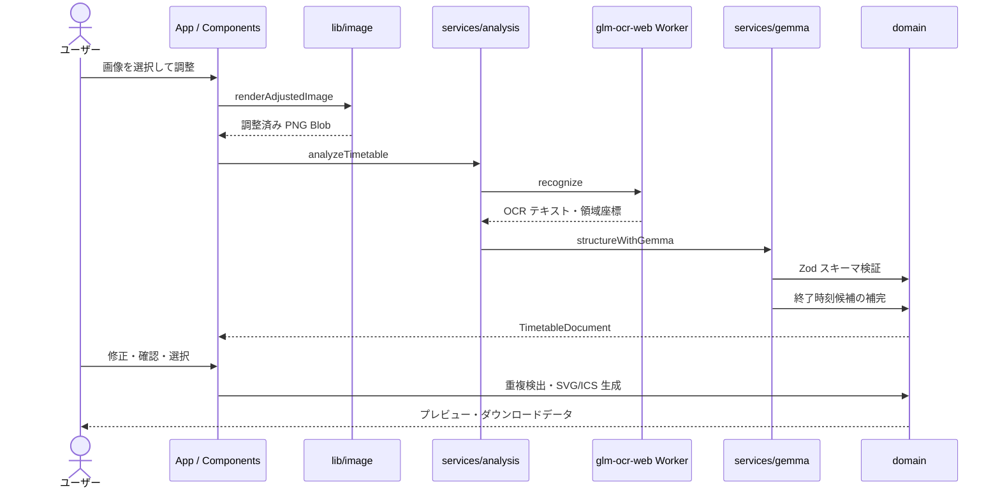

# アーキテクチャ

## この文書の位置づけ

この文書は、My Timetable の現在の実装構造と主要な責務の境界を説明する。プロダクト要件、制約、対象範囲、データ定義の正本は [`SPEC.md`](./SPEC.md) であり、この文書は仕様を置き換えない。実装と仕様に差異がある場合は `SPEC.md` を基準に扱う。

本アプリは、イベントのタイムテーブル画像を端末内で解析し、予定の確認・選択・タイムライン画像やカレンダーデータの出力までを行う、バックエンドを持たない単一ページの Web アプリである。

## システム全体像



アップロード画像、OCR 結果、修正内容、選択状態、生成結果は React の状態または一時的な Blob としてブラウザのメモリ内だけに保持する。外部通信はモデルファイルの取得と、ユーザーが明示的に実行した Google Calendar 登録に限られる。

## 実行時の構成

### アプリケーションシェルと画面遷移

エントリーポイントは `src/main.tsx` である。i18n の初期化後に React を起動し、`src/App.tsx` がアプリケーションシェルとして次の作業状態を一元管理する。

- 現在のステップ
- 元画像と解析用画像の Object URL
- 回転、明るさ、コントラスト、切り抜きの調整値
- `TimetableDocument`
- 選択中の予定 ID
- タイムライン表示設定
- 解析の進捗とエラー
- テーマと Gemma モデルの UI 設定

画面遷移にはルーターや外部状態管理ライブラリを使わず、`App.tsx` のステップ番号で次の 7 画面を切り替える。

1. `UploadStep` — 画像入力または手入力開始
2. `AdjustStep` — 画像の回転、補正、切り抜き
3. `AnalysisStep` — モデル取得と解析の進捗、キャンセル、再試行
4. `ReviewStep` — イベント情報と予定の編集・確認
5. `SelectionStep` — 出力対象の選択と重複確認
6. `TimelineStep` — タイムラインの見た目とレイアウトの編集
7. `ExportStep` — SVG、PNG、ICS、Google Calendar への出力

各ステップコンポーネントは、表示とユーザー操作を担当する。ステップをまたぐ作業状態は props とコールバックを通じて `App.tsx` に戻し、画面コンポーネント内へ永続化しない。

### 主要データフロー



1. `lib/image.ts` が Canvas API を使って画像の切り抜き、回転、明るさ・コントラスト補正、最大長辺への縮小を行う。
2. `services/analysis.ts` が解析ユースケースを調停し、OCR の完了後に Gemma を遅延ロードする。`AbortSignal` と進捗イベントは全体を通して伝播する。
3. `@my-timetable/glm-ocr-web` が画像を overview と複数列に分け、Web Worker 内で GLM-OCR を順次実行する。結果はテキスト、元画像サイズ、認識領域の座標を含む。
4. `services/gemma.ts` が OCR 結果だけを根拠に構造化 JSON を生成させ、値の正規化と Zod 検証を行う。明確な時刻・名称候補の決定論的な補完、認識領域の照合、終了時刻候補の付与もここからドメインロジックへ委譲する。
5. 編集後の `TimetableDocument` をドメイン関数が検証し、選択可能予定、時間重複、タイムライン SVG、ICS を導出する。

OCR と Gemma は同時常駐させない。OCR エンジンは処理終了時に破棄され、その後 Gemma のコードとモデルを読み込むことで、GPU メモリのピークを抑える。

## ディレクトリと責務

```text
.
├── src/
│   ├── components/        画面とユーザー操作
│   ├── domain/            スキーマとブラウザ非依存のドメインルール
│   ├── i18n/              言語解決、翻訳リソース、表示形式
│   ├── lib/               画像、切り抜き、ダウンロードのブラウザ機能
│   ├── services/          AI、モデルキャッシュ、Google Calendar との境界
│   ├── test/              Vitest 共通セットアップ
│   ├── App.tsx            ウィザード状態とユースケースの組み立て
│   └── main.tsx           ブラウザエントリーポイント
├── packages/
│   └── glm-ocr-web/       OCR ランタイムを隠蔽するローカルパッケージ
├── e2e/                   Playwright シナリオと解析テスト用 fixture
├── public/                そのまま配信する静的ファイル
├── docs/                  仕様、アーキテクチャ、調査記録
├── vite.config.ts         ビルド、テスト、解析実装の差し替え
└── playwright.config.ts   Pages と解析フローのブラウザテスト設定
```

### `src/domain`

UI やブラウザ API に依存しない、アプリの中心的な知識を置く。

| ファイル | 責務 |
|---|---|
| `timetable.ts` | Zod スキーマ、型、列挙値、空ドキュメント生成、予定日の解決 |
| `schedule-review.ts` | 完全性、確認可否、要確認判定、選択可能予定の抽出 |
| `conflicts.ts` | 時間重複、移動バッファ不足、不正時刻、重複行の検出 |
| `infer-end-times.ts` | 終了時刻がない予定への候補付与 |
| `export.ts` | タイムライン SVG、ICS、出力ファイル名の生成 |
| `errors.ts` | アプリ内部で共有するエラーコードと詳細情報 |

`TimetableDocument` の実行時スキーマと TypeScript 型の正本は `timetable.ts` の Zod スキーマである。予定種別、信頼度、終了時刻の出所も同じファイルで定義し、UI やサービス側に独自定義を作らない。

### `src/services`

外部ランタイム、外部 API、キャッシュなど、副作用を伴うユースケース境界を置く。

| ファイル | 責務 |
|---|---|
| `analysis.ts` | OCR と Gemma を順番に実行する解析ファサード |
| `analysis-contract.ts` | 本番解析と E2E fixture が共有する進捗契約 |
| `gemma.ts` | LiteRT-LM のロード、プロンプト、JSON の正規化・検証・後処理 |
| `gemma-model.ts` | E2B/E4B の選択条件と最小限の設定保存 |
| `model-config.ts` | OCR/Gemma のモデル ID、配信 URL、容量、キャッシュ名 |
| `model-cache.ts` | OCR と Gemma のモデルキャッシュ削除 |
| `google-calendar.ts` | OAuth と Calendar REST API をアダプターの背後に隔離 |

`google-calendar.ts` の `GoogleCalendarAdapter` は、登録ユースケースとブラウザ固有の Google 実装を分ける差し替え点である。アクセストークンは戻り値として処理中だけ保持し、Storage へ保存しない。

### `src/lib`

Canvas、DOM、ファイルダウンロードなどの汎用的なブラウザ処理を置く。ここにはタイムテーブルの業務ルールを入れない。

- `image.ts` — 画像検証と調整済み画像の生成
- `crop.ts` — 切り抜き矩形の座標変換、移動、リサイズ、クランプ
- `download.ts` — Blob の保存と SVG から PNG への変換

### `src/i18n`

i18next と react-i18next を使い、日本語と英語を名前空間単位で遅延ロードする。名前空間は各画面に対応し、型定義は日本語リソースを基準に生成する。

- 初期言語は `localStorage`、ブラウザ言語、日本語の順に解決する。
- 明示的な言語変更だけを `ui.language` に保存する。
- ドメイン層は翻訳済み文字列に依存しない。SVG、ICS、Google Calendar に必要な表示ラベルは UI 側から生成関数へ渡す。
- アプリ固有エラーはコードとして伝播させ、表示境界で翻訳する。

### `packages/glm-ocr-web`

アプリ本体から Transformers.js、ONNX Runtime Web、モデル構成、Web Worker、Cache Storage の詳細を隠すローカルパッケージである。アプリは公開 API の `createOcrEngine()` と OCR の型だけに依存する。

```text
src/index.ts          公開 API
src/types.ts          OcrEngine、結果、進捗、エラーの契約
src/worker-engine.ts  メインスレッド側の Worker アダプター
src/glm-worker.ts     Worker のメッセージ処理とキャンセル
src/glm-engine.ts     モデルロード、領域分割、逐次 OCR、解放
src/config.ts         モデル ID、revision、量子化構成、キャッシュ名
```

この境界により、OCR モデルやランタイムを変更しても、`OcrEngine` 契約を維持する限りアプリ側への影響を限定できる。

## 依存方向

基本の依存方向は次のとおりである。

```text
main.tsx
  └─ App.tsx
      ├─ components
      ├─ services ──> domain
      ├─ lib ───────> domain/errors
      └─ domain

services/analysis ──> @my-timetable/glm-ocr-web
components ─────────> i18n
```

変更時は次の境界を維持する。

- `domain` は React、DOM、Canvas、Storage、ネットワーク、翻訳ライブラリへ依存しない。
- `components` はモデル取得や OAuth の詳細を直接実装せず、`services` の公開関数を使う。
- AI 出力を UI の型として直接信用せず、必ず `timetableDocumentSchema` を通す。
- OCR ランタイムの詳細は `packages/glm-ocr-web` の外へ漏らさない。
- 設定値、モデル情報、翻訳キー、ドメイン列挙値はそれぞれの正本から参照する。

## 状態、保存、プライバシー

| データ | 保持場所 | 寿命 |
|---|---|---|
| 元画像、調整済み画像 | Blob / Object URL | 現在のページのみ |
| OCR・構造化結果、修正、選択 | React state | 現在のページのみ |
| テーマ | `localStorage["ui.theme"]` | 明示的に初期化するまで |
| 表示言語 | `localStorage["ui.language"]` | 明示的に初期化するまで |
| Gemma モデル選択 | `localStorage["ui.gemmaModel"]` | 利用条件を満たす間 |
| OCR/Gemma モデル本体 | Cache Storage | キャッシュ削除または更新まで |
| Google OAuth トークン | 関数内のメモリ | 登録処理中のみ |

Object URL は置き換え時とアプリのアンマウント時に revoke する。作業開始後のページ離脱には警告を出すが、作業データの復元機能は持たない。IndexedDB、Cookie、アプリ用バックエンドは使用しない。

## ビルド時の差し替えと遅延ロード

Vite の `#analysis` エイリアスが解析実装の差し替え点である。

- 通常、debug、実モデル E2E: `src/services/analysis.ts`
- fake E2E: `e2e/fixtures/analysis.ts`

fake E2E でも UI と画面遷移は本番コードを使い、重いモデル取得だけを決定的な fixture に置き換える。Gemma 実装は `analysis.ts` から dynamic import されるため、初期画面では AI 関連コードと大容量モデルを読み込まない。Debug Panel も debug モードでのみ遅延ロードする。

GitHub Pages のプロジェクトサイトで動作させるため、Vite の `base` は `/my-timetable/` に固定している。アプリは深い URL を持たない単一ページ構成である。

## テストとデプロイ

テストは責務の境界に合わせて次の層に分かれる。

- `src/**/*.test.ts(x)` — Vitest、Testing Library、jsdom によるドメイン・サービス・コンポーネントテスト
- `packages/**/*.test.ts` — OCR の領域分割、モデル設定、進捗などのパッケージテスト
- `e2e/pages.spec.ts` — Pages のサブパス配信、初期表示、AI コードの遅延ロード
- `e2e/analysis.spec.ts` — アップロードから解析結果確認までのブラウザフロー

品質ゲートの正本は `package.json` の scripts である。

```sh
bun run format:check
bun run lint
bun run test
bun run build
```

Pull Request では `develop` 向けに品質ゲートと fake 解析の Playwright テストを実行する。`main` への push または手動実行では同じ検証後に `dist/` を GitHub Pages へデプロイする。Google Calendar のクライアント ID はビルド時の `VITE_GOOGLE_CLIENT_ID` として注入し、クライアントシークレットは使わない。

## 変更を加えるときの配置指針

- データ構造や不変条件を変える場合は、最初に `domain/timetable.ts` と `SPEC.md` の整合を確認する。
- 判定や計算が UI なしで表現できる場合は `domain` に置き、純粋関数としてテストする。
- ブラウザ API または外部ランタイムとの接続は `lib` または `services` に隔離する。
- 新しい画面固有の表示と操作は `components` に置き、ステップ間で共有する作業状態は `App.tsx` に集約する。
- OCR のモデル、分割、Worker、キャッシュ方式を変える場合は `packages/glm-ocr-web` の公開契約を保つ。
- 新しい表示文言は日本語・英語の同じ名前空間へ追加し、ユーザーデータを翻訳しない。
- 新しい永続化項目を追加する前に、`SPEC.md` の保存・プライバシー制約を確認する。

アーキテクチャ上の新しい重要判断が必要になった場合は、この概要へ実装詳細を増やし続けるのではなく、まず `SPEC.md` の要件を更新し、必要に応じて ADR など判断理由を残す文書を別途追加する。
